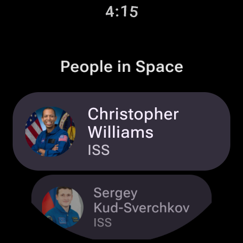
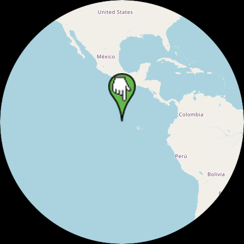

# PeopleInSpace


**Kotlin Multiplatform** project with SwiftUI, Jetpack Compose, Compose for Wear OS, Compose for Desktop and Compose for Web clients along with Ktor backend. Currently running on
* Android (Jetpack Compose)
* Android App Widget (Compose based Glance API - contributed by https://github.com/yschimke)
* Wear OS (Compose for Wear OS - primarily developed by https://github.com/yschimke)  
* iOS (SwiftUI)
* Swift Executable Package
* Desktop (Compose for Desktop)
* Web (Compose for Web - Wasm based)
* JVM (small Ktor back end service + `Main.kt` in `common` module)
* MCP server (using same shared KMP code)

The people data comes from [The Space Devs API](https://thespacedevs.com/llapi) (names, bios and images of the people
currently in space) and the position of the International Space Station from the
[Open Notify ISS-Now API](http://open-notify.org/Open-Notify-API/ISS-Location-Now/), both served through this
project's own small Ktor backend (see `backend` module below).

The project is included as sample in the official [Kotlin Multiplatform docs](https://kotlinlang.org/docs/multiplatform-samples.html) and also the [Google Dev Library](https://devlibrary.withgoogle.com/products/android)

### Module overview

| Module | Description |
|---|---|
| `common` | Shared KMP code (Ktor, SQLDelight, Koin, view models) and shared Compose Multiplatform UI |
| `app` | Android client (Jetpack Compose), including Glance app widget |
| `wearApp` | Wear OS client (Compose for Wear OS) |
| `PeopleInSpaceSwiftUI` | iOS client (SwiftUI) |
| `compose-desktop` | Desktop client (Compose for Desktop) |
| `compose-web` | Web client (Compose for Web, Kotlin/Wasm) |
| `backend` | Ktor server providing the people/ISS data (deployable to Google App Engine) |
| `mcp-server` | Model Context Protocol server exposing the shared KMP code |

### Building and running

Requirements: JDK 17, a recent version of Android Studio (for the Android/Wear clients) and Xcode (for the iOS client).

* **Android**: run the `app` configuration from Android Studio (or `./gradlew :app:installDebug`)
* **Wear OS**: run the `wearApp` configuration from Android Studio (or `./gradlew :wearApp:installDebug`)
* **iOS**: open `PeopleInSpaceSwiftUI` in Xcode and run from there
* **Desktop**: `./gradlew :compose-desktop:run`
* **Web (Wasm)**: `./gradlew :compose-web:wasmJsBrowserDevelopmentRun`
* **Backend**: `./gradlew :backend:run` (or run `Server.kt` directly from Android Studio). After doing that you should then for example be able to open `http://localhost:9090/astros_local.json` in a browser.

Tests can be run with `./gradlew :common:jvmTest`, and there's also a [Maestro](https://maestro.mobile.dev/) UI test
flow for the Android client (`maestro test maestro/PeopleInSpace.flow`).

### Backend deployment

Have tested this out in Google App Engine deployment.  Using shadowJar plugin to create an "uber" jar and then deploying it as shown below.  Should be possible to deploy this jar to other services as well.

```
./gradlew :backend:shadowJar
gcloud app deploy backend/build/libs/backend-all.jar --appyaml=backend/src/jvmMain/appengine/app.yaml
```

### Screenshots 

**iOS (SwiftUI + CMP)**
<br/>


**Android (Jetpack Compose + CMP)**
<br/>


**Wear OS (Wear Compose)**
<br/>





**Compose for Desktop**
<br/>


**Compose for Web (Wasm based)**
<br/>


**MCP**

The `mcp-server` module uses the [Kotlin MCP SDK](https://github.com/modelcontextprotocol/kotlin-sdk) to expose an MCP tools endpoint (returning list of people in space) that
can for example be plugged in to Claude Desktop as shown below.  That module uses same KMP shared code (that uses for example Ktor, SQLDelight and Koin)


To integrate the MCP server with Claude Desktop you need to firstly run gradle `shadowJar` task and then select "Edit Config" under Developer Settings and add something 
like the following (update with your path)

```
{
  "mcpServers": {
    "kotlin-peopleinspace": {
      "command": "java",
      "args": [
        "-jar",
        "<path-to-repo>/mcp-server/build/libs/serverAll.jar",
        "--stdio"
      ]
    }
  }
}
```

### Related posts

* [Minimal Kotlin Multiplatform project using Compose and SwiftUI](https://johnoreilly.dev/posts/minimal-kotlin-platform-compose-swiftui/)
* [Adding some Storage (to) Space](https://johnoreilly.dev/posts/adding-sqldelight-to-peopleinspace/)
* [Kotlin Multiplatform running on macOS](https://johnoreilly.dev/posts/kotlinmultiplatform-macos/)
* [PeopleInSpace hits the web with Kotlin/JS and React](https://johnoreilly.dev/posts/peopleinspace-kotlinjs/)
* [Using Koin in a Kotlin Multiplatform Project](https://johnoreilly.dev/posts/kotlinmultiplatform-koin/)
* [Jetpack Compose for the Desktop!](https://johnoreilly.dev/posts/jetpack-compose-desktop-copy/)
* [Comparing use of LiveData and StateFlow in a Jetpack Compose project](https://johnoreilly.dev/posts/jetpack-compose-stateflow-livedata/)
* [Wrapping Kotlin Flow with Swift Combine Publisher in a Kotlin Multiplatform project](https://johnoreilly.dev/posts/kotlinmultiplatform-swift-combine_publisher-flow/)
* [Using Swift Packages in a Kotlin Multiplatform project](https://johnoreilly.dev/posts/kotlinmultiplatform-swift-package/)
* [Using Swift's new async/await when invoking Kotlin Multiplatform code](https://johnoreilly.dev/posts/swift_async_await_kotlin_coroutines/)
* [Exploring new AWS SDK for Kotlin](https://johnoreilly.dev/posts/aws-sdk-kotlin/)
* [Creating a Swift command line app that consumes Kotlin Multiplatform code](https://johnoreilly.dev/posts/swift-command-line-kotlin-multiplatform/)
* [Exploring New Worlds of UI sharing possibilities in PeopleInSpace using Compose Multiplatform](https://johnoreilly.dev/posts/exploring-compose_multiplatform_sharing_ios/)

### Related samples

Note that this repository very much errs on the side of minimalism to help more clearly illustrate key moving parts of a Kotlin
Multiplatform project and also to hopefully help someone just starting to explore KMP to get up and running for first time (and is of course
primarily focused on use of Jetpack Compose and SwiftUI).  If you're at the stage of moving
beyond this then I'd definitely recommend checking out [KaMPKit](https://github.com/touchlab/KaMPKit) from Touchlab.
I also have the following samples that demonstrate the use of a variety of Kotlin Multiplatform libraries (and also use Jetpack Compose and SwiftUI).

*  GalwayBus (https://github.com/joreilly/GalwayBus)
*  Confetti (https://github.com/joreilly/Confetti)
*  BikeShare (https://github.com/joreilly/BikeShare)
*  FantasyPremierLeague (https://github.com/joreilly/FantasyPremierLeague)
*  ClimateTrace (https://github.com/joreilly/ClimateTraceKMP)
*  GeminiKMP (https://github.com/joreilly/GeminiKMP)
*  MortyComposeKMM (https://github.com/joreilly/MortyComposeKMM)
*  StarWars (https://github.com/joreilly/StarWars)
*  WordMasterKMP (https://github.com/joreilly/WordMasterKMP)
*  Chip-8 (https://github.com/joreilly/chip-8)

### Languages, libraries and tools used

* [Kotlin](https://kotlinlang.org/)
* [Kotlin Coroutines](https://kotlinlang.org/docs/reference/coroutines-overview.html)
* [Kotlinx Serialization](https://github.com/Kotlin/kotlinx.serialization)
* [Ktor client library](https://github.com/ktorio/ktor)
* [Android Architecture Components](https://developer.android.com/topic/libraries/architecture/index.html)
* [Koin](https://github.com/InsertKoinIO/koin) (using [Koin Annotations](https://insert-koin.io/docs/reference/koin-annotations/start) and the [Koin compiler plugin](https://insert-koin.io/docs/setup/compiler-plugin/))
* [SQLDelight](https://github.com/cashapp/sqldelight)
* [Jetpack Compose](https://developer.android.com/jetpack/compose)
* [Compose Multiplatform](https://www.jetbrains.com/compose-multiplatform/)
* [Compose for Wear OS](https://developer.android.com/training/wearables/compose)
* [SwiftUI](https://developer.apple.com/documentation/swiftui)
* [SKIE](https://skie.touchlab.co/intro)
* [Coil](https://coil-kt.github.io/coil/)
* [Kermit](https://kermit.touchlab.co/)
* [Maestro](https://maestro.mobile.dev/)
